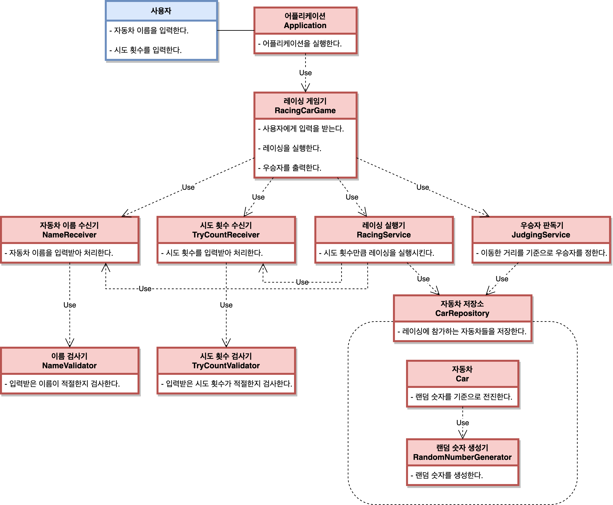

# 미션 - 자동차 경주 게임

## 💡 미션 목표

- 자동차 경주 게임을 구현한다.

## 🏎 자동차 경주 게임

- 경주에 참가하는 자동차 이름들과 시도 횟수를 입력받는다.
- 자동차들이 입력된 횟수만큼 운전을 시도한다.
- 가장 멀리 이동한 자동차를 우승자라고 하고 이름을 출력한다.

## 🖇 객체들의 역할과 책임 그리고 협력

## 🗒 기능 목록

- [x] 자동차 경주 게임 과정을 진행하는 기능
- [x] 자동차 이름을 입력받는 기능
    - [x] 입력받은 이름 문자열을 ',' 기준으로 분리해서 List 로 만드는 기능
    - [x] 입력받은 자동차 이름이 적절한지 검사하는 기능
        - [x] `예외 / 이름이 5자 초과 혹은 1자 미만 일 경우 -> 에러 메시지를 출력하고 다시 입력을 받는다.`
        - [x] `예외 / 이름이 공백으로 이루어져 있을 경우 -> 에러 메시지를 출력하고 다시 입력을 받는다.`
        - [x] `예외 / 중복되는 이름이 존재하는 경우 -> 에러 메시지를 출력하고 다시 입력을 받는다.`
- [x] 총 레이싱 시도 횟수를 입력받는 기능
- [x] 입력받은 레이싱 시도 횟수의 값이 적절한지 검사하는 기능
    - [x] `예외 / 입력받은 값이 숫자가 아닌 경우 -> 에러 메시지를 출력하고 다시 입력을 받는다.`
    - [x] `예외 / 입력받은 값이 자연수가 아닌 경우 -> 에러 메시지를 출력하고 다시 입력을 받는다.`
- [x] 입력받은 자동차 이름으로 자동차 객체의 인스턴스를 생성하는 기능
- [x] 경주에 참가하는 자동차 객체의 인스턴스를 저장하는 기능
- [x] 0 ~ 9 사이에 무작위 값을 생성하는 기능
- [x] 생성된 무작위 숫자가 4 이상일 때 자동차 객체가 전진을 하며 위치를 변경하는 기능
- [x] 자동차 객체들이 총 레이싱 시도 횟수 만큼 레이싱을 수행하는 기능
- [x] 자동차 객체가 현재 위치 상태를 문자열 형태로 표현하는 기능
- [x] 자동차 객체들의 현재 위치 상태를 각 레이싱 시도 마다 기록하는 기능
- [x] 최종우승자를 판별하는 기능
