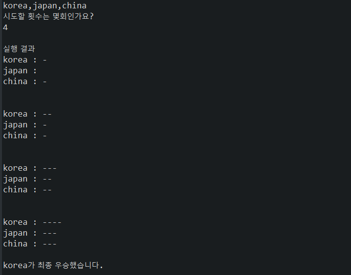

### 자동차 경주 게임

---
#### 1. 프로그램 개요

> * 사용자는 자동차의 이름과 진행 횟수를 입력한다.
>
> * 각 자동차가 주어진 횟수동안 전진 혹은 정지 한다.
>
> * 주어진 횟수만큼 게임이 진행된 후 승자를 판별한다.

---
#### 2. 기능 요구사항

> * 진행 횟수 및 각 자동차의 이름을 입력 받는다.(5글자 이하)
>
> * 0-9 사이의 임의의 수 중 4이상이면 전진, 3이하이면 정지한다.
>
> * 진행이 종료된후 우승자를 판별한다. 공동우승 또한 가능하다. 

---
#### 3. 구현 기능 목록

> * 진행 횟수 및 차 이름 입력 받기
>
> * 입력 데이터 예외 처리하기 (글자 수, 자연수 여부)
>
> * 입력 데이터를 이용해 게임 진행하기
>
> * 각 자동차 별로 0-9 사이의 임의의 수를 부여해 전진 또는 정지하기
>
> * 진행이 끝날 때 마다 현재 상황 출력하기
>
> * 진행종료 후 우승자 판별하기, 결과 출력하기

---
#### 4. 프로그램 실행 예시

