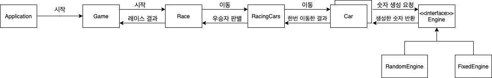

# 미션 - 자동차 경주 게임

 

## 📈 프로젝트 설명

 

### 주제

사용자는 자동차의 이름과 이동 횟수를 입력하고, 각 자동차는 랜덤하게 전진하여 최종 우승자를 뽑아내는 콘솔 게임 프로젝트.

 

### 기능 요구사항

- 주어진 횟수 동안 n대의 자동차는 전진 또는 멈출 수 있다.
- 각 자동차에 이름을 부여할 수 있다. 전진하는 자동차를 출력할 때 자동차 이름을 같이 출력한다.
- 자동차 이름은 쉼표(,)를 기준으로 구분하며 이름은 5자 이하만 가능하다.
- 사용자는 몇 번의 이동을 할 것인지를 입력할 수 있어야 한다.
- 전진하는 조건은 0에서 9 사이에서 random 값을 구한 후 random 값이 4 이상일 경우 전진하고, 3 이하의 값이면 멈춘다.
- 자동차 경주 게임을 완료한 후 누가 우승했는지를 알려준다. 우승자는 한 명 이상일 수 있다.

 

### 프로그래밍 요구사항

- 자바 코드 컨벤션을 지키면서 프로그래밍한다.
  - 기본적으로 [Google Java Style Guide](https://google.github.io/styleguide/javaguide.html)을 원칙으로 한다.
  - 단, 들여쓰기는 '2 spaces'가 아닌 '4 spaces'로 한다.
- indent(인덴트, 들여쓰기) depth를 3이 넘지 않도록 구현한다. 2까지만 허용한다.
- 3항 연산자를 쓰지 않는다.
- 함수(또는 메소드)의 길이가 15라인을 넘어가지 않도록 구현한다.
  - 함수(또는 메소드)가 한 가지 일만 잘 하도록 구현한다.
- else 예약어를 쓰지 않는다.
  - 힌트: if 조건절에서 값을 return하는 방식으로 구현하면 else를 사용하지 않아도 된다.
  - else를 쓰지 말라고 하니 switch/case로 구현하는 경우가 있는데 switch/case도 허용하지 않는다.

 

## 👨‍💻 기능 목록 및 객체 설계

> 아는 것 : 멤버 변수 혹은 핵심 변수
>
> 하는 것 : 메서드 혹은 메시지 전달

### Game

* 책임 : 사용자 입력 (자동차 이름, 움직임 횟수) / 게임 시작
* 아는 것 : Scanner
* 하는 것 : 사용자 입력 (예외 처리) / 레이스(`Race`) 시작 요청 메시지
  * 예외처리 (자동차 이름) : 5자 이상 / 빈 이름(`,,`) / 공백
  * 예외처리 (이동 횟수) : 문자열 혹은 소수 / 음수

 

### Race

* 책임 : 레이스 시작 / 레이스 결과 반환
* 아는 것 : 레이싱 결과 (String) / 자동차 움직임 횟수 /  자동차들
* 하는 것 : 레이싱 자동차들(`RacingCars`)에게 이동 메시지 요청 / 레이싱 자동차들(`RacingCars`) 이동 및 결과 기록

 

### RacingCars

* 책임 : 모든 자동차 이동 요청 / 가장 빠른(멀리 간) 자동차 판별
* 아는 것 : 레이싱에 참여하는 자동차들 (`List<Car>`) / 가장 빠른(멀리 간) 위치 값
* 하는 것 : 각각의 자동차에게 이동 메시지 요청 / 가장 빠른 자동차 판별

 

### Car

* 책임 : 이동 / 현재 위치 반환
* 아는 것 : 이름 / 위치
* 하는 것 : `Engine`으로부터 값을 받아 자동차 이동 / 현재 위치 결과 반환 (`이름 : 현재 위치`)

 

### Engine

* 책임 : 숫자 반환
* 아는 것 : 랜덤 값 범위 (혹은 지정 값)
* 하는 것 : 랜던한 값 생성하여 반환.

 

## 게임 시나리오

1. `Application`객체가 `Game`객체를 생성하고 시작 요청 (`start()`)을 보낸다.
2. `Game`객체는 사용자 입력 (자동차 이름, 이동 횟수)을 받아 레이스(`Race`)객체에게 레이스 시작 요청(`start()`)을 보낸다.
3. `Race`객체는 `Game`으로부터 받은 자동차 이름을 바탕으로 `Car`들을 만들어 `RaceCars`를 만든다. 입력 받은 이동 횟수만큼 `RacingCars`에게 이동 요청을 보낸다.
4. `RacingCars`를 자동차들(`List<Car>`)에게 이동 요청을 보낸다.
5. `Car`들은 `Engine`에게 숫자 생성 요청을 하고 반환된 숫자를 바탕으로 이동한다. (3이하면 작으면 이동 X) 그리고 이동한 결과를 `RacingCars`에게 보낸다.
6. `RacingCars`는 `Car`가 반환한 이동 결과를 다시 `Race`에게 보낸다.
7. `Race`는 `Car`의 이동 결과를 기록하고 있는다. (`racingResult`)
8. 모든 이동이 종료되면 `Race`는 `RacingCars`에게 우승자 판별을 요청하고, `Race`는 우승자 결과를 기록하여, `Game`에게 반환한다.
9. `Game`은 반환받은 레이스 결과를 출력하고 게임은 종료된다.

 

## 📝 License

This project is [MIT](https://github.com/woowacourse/java-racingcar-precourse/blob/master/LICENSE) licensed.