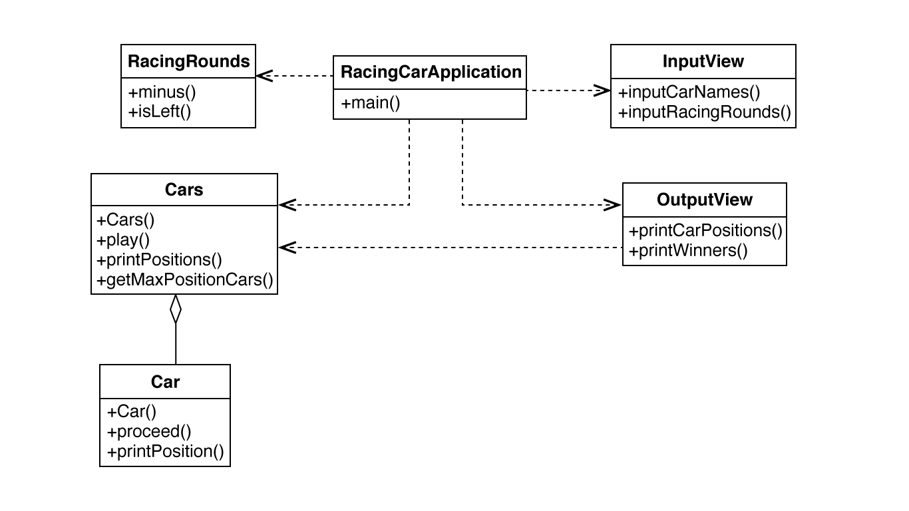

# 자동차 경주 게임

> [우아한테크코스](https://github.com/woowacourse) 프리코스 2주차 미션으로 주어진 [자동차 경주 게임](https://github.com/woowacourse/java-racingcar-precourse)입니다.

경주할 자동차들의 이름과 경주를 진행할 라운드 회수를 입력하면 게임이 시작됩니다. 한 라운드에서 모든 자동차들은 각각 난수를 생성하고 그 결과값에 따라 1회 전진하거나 정지합니다. 한 라운드가 끝날때마다 자동차들의 위치를 출력합니다. 모든 라운드가 진행되고 나면 가장 멀리 이동한 우승자를 출력합니다. 우승자들은 여러명일 수 있습니다.

## 구현 기능 목록

- 경주할 자동차의 이름 n개를 입력받는 기능
- 입력받은 자동차의 이름으로 경주할 자동차들을 생성하는 기능
    - 예외 : 자동차의 이름이 5자를 초과하는 경우, 자동차의 이름이 공백인 경우, 자동차의 이름이 중복될 경우
- 이동할 회수 k를 입력받는 기능
    - 예외 : 입력된 값이 숫자가 아닌 경우, 이동할 회수가 양수가 아닌 경우(ex: 0, -3)
- n개의 자동차별로 0에서 9사이의 랜덤 숫자 n개를 구하는 기능
- 랜덤 숫자에 따라 자동차를 이동/정지하는 기능
    - 랜덤 숫자가 4이상일 경우 전진, 3이하일 경우 정지
- 자동차들의 이동 결과를 출력하는 기능
- 3~4번을 k회 반복한 후, 우승자를 출력하는 기능

## UML 다이어그램



## 게임 진행 방법

자동차들의 이름을 입력합니다.    

 - 자동차의 이름은 5자 이하만 가능합니다.
 - 자동차의 이름은 공백일 수 없습니다.
 - 자동차들의 이름은 중복될 수 없습니다.

```sh
경주할 자동차 이름을 입력하세요.(이름은 쉼표(,) 기준으로 구분)
> moon, woowa, a123
```
시도할 라운드의 회수를 입력합니다.

 - 숫자만 입력할 수 있습니다.
 - 라운드의 회수는 양수만 가능합니다.

```sh
시도할 회수는 몇회인가요?
> 24
```

## 업데이트 내역

- 0.0.1
    - 작업 진행 중