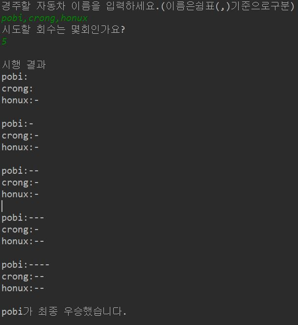

# 자동차 경주 게임

## 소개
    랜덤한 숫자를 뽑아서 전진 또는 정지하는 자동차 경주 게임
    친구들과 내기를 할 때 사용해 볼 만하다.  

## 기능목록
### Car class
    1. 자동차 이름을 변수로 객체를 생성
    2. 자동차의 위치을 하나 증가
    3. 자동차의 전진, 정지을 판단해서 자동차의 위치를 이동
    4. 자동차의 위치를 반환
    5. 자동차의 이름을 반환
    
### RacingGame class
    1. 자동차 이름을 쉼표로(,) 구분해서 받기
    2. 시행횟수를 받기
    3. 받은 시행횟수만큼 게임을 진행
    4. 자동차의 위치를 보여주는 함수
    5. 최종 결과를 리스트로 만들어서 반환
    6. 최종 결과 그리기
    
### RacingCar class
    1. 게임 실행 순서에 따른 메인함수