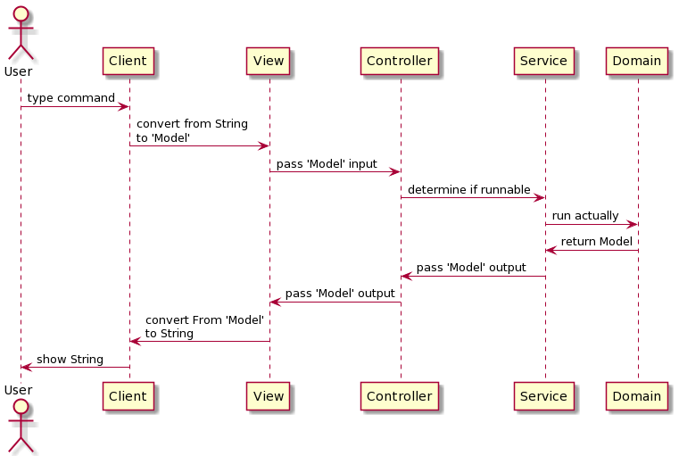

# 미션 - 자동차 경주 게임

## 개요

본 미션의 목표는 사용자의 콘솔을 기반으로,  
랜덤으로 전진하는 자동차들의 경주를 보여주는 게임을 구현하는 것이다.

## 기능

1. (사용자) 각 자동차의 이름을 입력한다.(이름은 쉼표로 구분하며, 6자 이상은 불가능하다.)
2. (사용자) 전진을 시도할 회수를 입력한다.
3. 각 시도에 따른 전진 결과를 표시한다.
4. 최종 우승자를 표시한다(공동 우승자가 존재할 수 있으며, 쉼표로 구분된다.)

## 구현 목록

- 시퀀스 다이어그램 : 다음과 같은 흐름을 목표로 한다.
  

- **공통**
- [✅] 사용자가 잘못된 값을 입력할 경우 IllegalArgumentException를 발생시키고,  
  "[ERROR]"로 시작하는 에러 메시지를 출력 후 그 부분부터 입력을 다시 받는다.
- **게임**
    - **자동차 이름**
        - [✅] 게임을 시작하기 전, 자동차의 이름을 입력받는다.
        - [✅] 입력은 한줄에 받으며, 쉼표로 구분한다.
        - [✅] 이름은 5글자 이하만 가능하다.
        - *예외 케이스*
            - [✅] 이름이 5글자 초과인 경우(e.g. cjlee38)
            - [✅] 이름이 비어 있는 경우(e.g. pobi,,jun)
            - [✅] 입력이 없는 경우(e.g. "")
    - **전진 시도**
        - [✅] 전진을 시도할 횟수의 숫자를 입력받는다.
        - *예외 케이스*
            - [✅] 시도한 값이 정수형이 아닌 경우(e.g. 문자, 문자열, 실수 등)
            - [✅] 시도한 값이 0 이하인 경우
            - [✅] 전진을 시도할 횟수가 너무 큰 경우(e.g. 2^31, 혹은 2^64 이상인경우)
    - **승리**
        - [✅] 게임 종료시, 가장 멀리 전진한 자동차가 승리한다.
        - [❌] 공동 우승자가 있을 경우, 쉼표로 구분하여 출력한다(e.g. pobi, jun)
- **자동차**
    - **전진 전략**
        - [✅] 0에서 9 사티의 무작위 값을 구한 뒤, 4 이상일 경우 1칸 전진한다.

## 프로그래밍 요구사항

- [❌] JDK 8 버전에서 실행 가능해야 한다. **JDK 8에서 정상 동작하지 않을 경우 0점 처리**한다.
- [❌] 자바 코드 컨벤션을 지키면서 프로그래밍한다.
- [❌] indent(인덴트, 들여쓰기) depth를 3이 넘지 않도록 구현한다. 2까지만 허용한다.
- [❌] 함수(또는 메소드)가 한 가지 일만 하도록 최대한 작게 만들어라.
- [❌] 함수(또는 메소드)의 길이가 15라인을 넘어가지 않도록 구현한다.
- [❌] else 예약어를 쓰지 않는다.

### Car 객체

- [✅] Car 기본 생성자를 추가할 수 없다.
- [✅] name, position 변수의 접근 제어자인 private을 변경할 수 없다.
- [✅] 가능하면 setPosition(int position) 메소드를 추가하지 않고 구현한다.

### Randoms, Console

- [❌] DK에서 기본 제공하는 Random, Scanner API 대신 `camp.nextstep.edu.missionutils`에서 제공하는 `Randoms`, `Console` API를 활용해 구현해야 한다.
    - [❌] Random 값 추출은 `camp.nextstep.edu.missionutils.Randoms`의 `pickNumberInRange()`를 활용한다.
    - [❌] 사용자가 입력하는 값은 `camp.nextstep.edu.missionutils.Console`의 `readLine()`을 활용한다.
- [❌] 프로그램 구현을 완료했을 때 `src/test/java` 디렉터리의 `ApplicationTest`에 있는 모든 테스트 케이스가 성공해야 한다. **테스트가 실패할 경우 0점 처리한다.**

## 과제 요구사항

- 미션은 [java-racingcar-precourse](https://github.com/woowacourse/java-racingcar-precourse) 저장소를 Fork/Clone해 시작한다.
- **기능을 구현하기 전에 java-racingcar-precourse/docs/README.md 파일에 구현할 기능 목록을 정리**해 추가한다.
- **Git의 커밋 단위는 앞 단계에서 README.md 파일에 정리한 기능 목록 단위**로 추가한다.
- 과제 진행 및 제출 방법은 [프리코스 과제 제출 문서](https://github.com/woowacourse/woowacourse-docs/tree/master/precourse) 를 참고한다.

