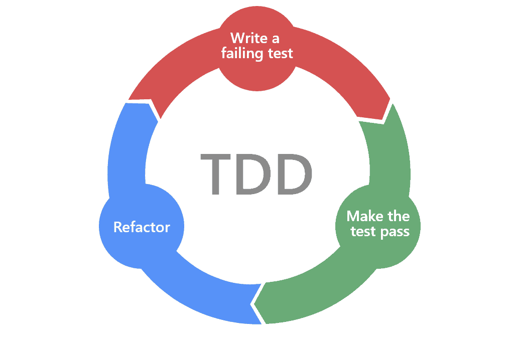

# 미션을 진행하면서 상기해야 할 리스트

## MVC 패턴 활용하기

[참고](https://velog.io/@ljinsk3/MVC-패턴)

- view를 구현할 때 주의할 점은 도메인 로직의 어떤 것도 알고 있으면 안된다는 것이다.   
  절대적으로 객체를 전달받아 상태를 바로 출력하는 역할만을 담당해야 한다.
-

## SRP, Single Responsibility Principle, 단일 책임 원칙

- 하나의 클래스가 하나의 책임을 갖도록 할 것
- 클래스를 변경하는 이유는 하나여야 한다.
- 하나의 모듈은 하나의, 오직 하나의 액터에 대해서만 책임져야 한다.(*Clean Architecture*, Robert C. Martin)
    - ([참고](https://coco-log.tistory.com/163))

## 테스트를 먼저 생성하기

1. 실패하는 테스트를 먼저 만든다.
2. 테스트를 통과시키는 코드를 작성한다.
3. 코드를 리팩토링한다.

## How to code ? top-down vs bottom-up

[Write code top-down](https://www.teamten.com/lawrence/programming/write-code-top-down.html)

## 깃 커밋 메시지 - 본문에 "왜?"를 적기

좋은 git 커밋 메시지를 작성하기 위한 7가지 약속 중,

**본문은 어떻게보다 무엇을, 왜에 맞춰 작성하기**
[출처](https://meetup.toast.com/posts/106)